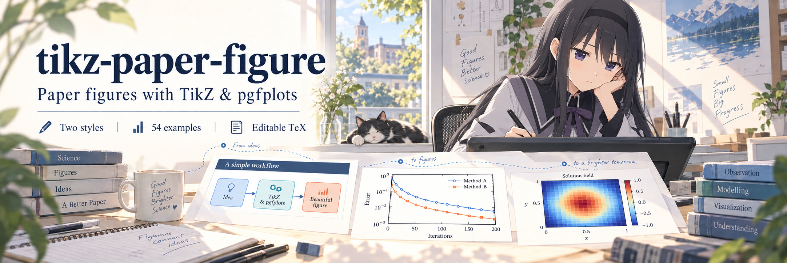
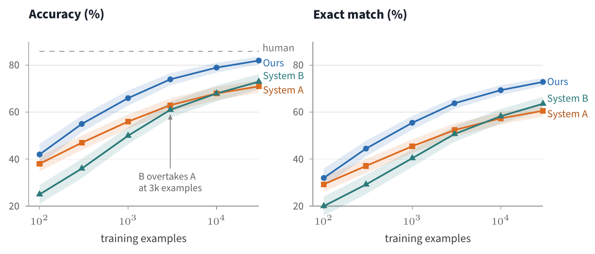
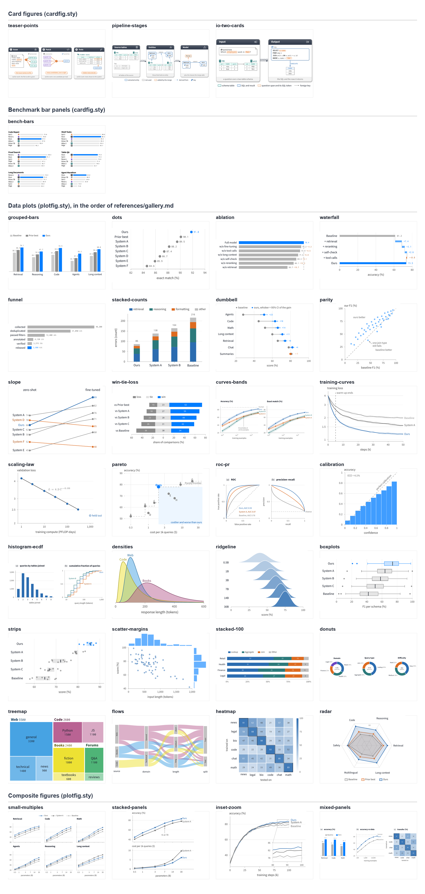
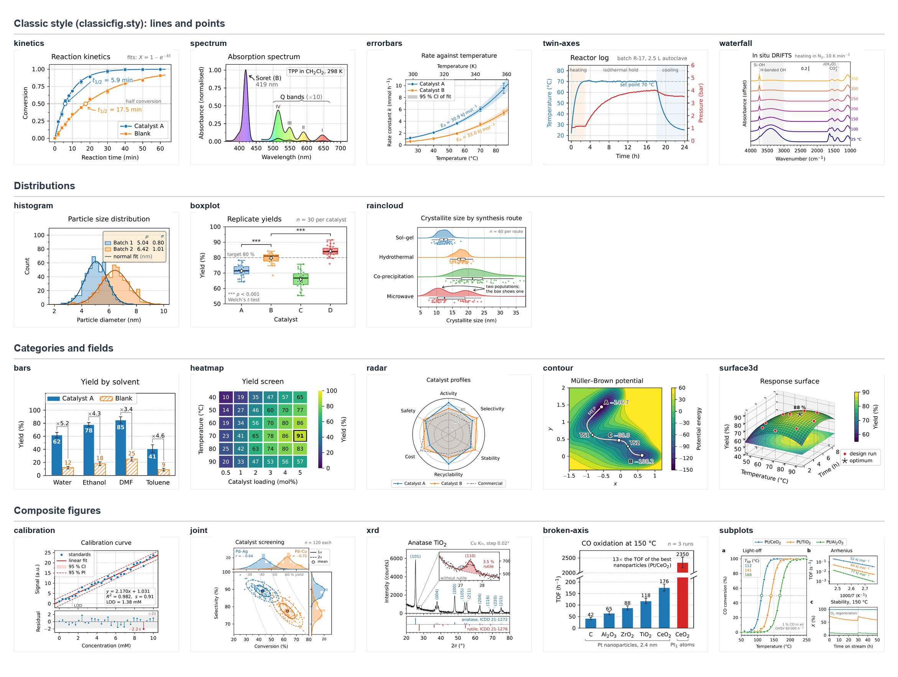
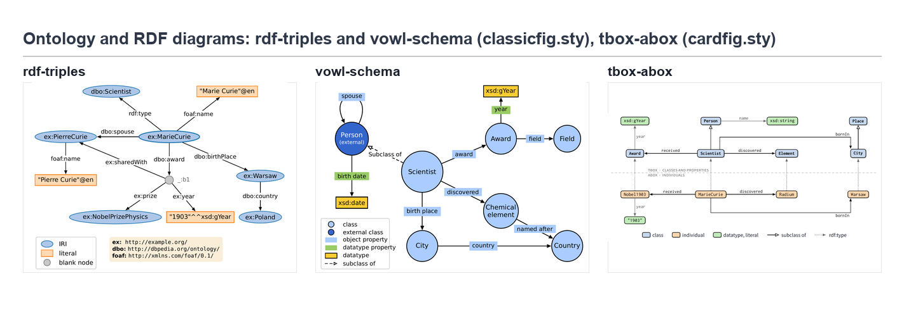

# tikz-paper-figure



Paper figures in TikZ and pgfplots, from schematic cards and data plots to multi-panel figures. Two styles, 57 compiled examples, and an agent workflow that takes your data through to a rendered figure.

[中文说明](README.zh-CN.md) · [Install](#install) · [Quick start](#quick-start) · [Full gallery](skills/tikz-paper-figure/references/gallery.md)

## What is in the box

- `cardfig.sty`: cards with dark title bars, pills, footer bands and shadows, plus benchmark bar panels. `plotfig.sty`: a `paper` axis style for pgfplots with the same fonts and colours, direct labels, bars from zero, grey ticks, digits in the text font.
- `classicfig.sty`: the classic style, Matplotlib's rcParams in pgfplots (DejaVu Sans, the four-sided frame, tab10, the rounded legend frame) plus one key or macro for each touch a careful Matplotlib user adds: light grid, white marker edges, halos, spans, text boxes, significance brackets, broken axes, a legend for a whole composite.
- Three templates (`template.tex`, `template-bars.tex`, `template-plot.tex`) and 57 examples with their renders: 3 card figures, 1 bar-panel grid, 28 data plots and 4 composite figures in the house style; 13 plots and 5 composite figures (fit with residuals, scatter with marginals, inset zoom, broken axis, mosaic) in the classic style, with the numpy script that makes their data; 3 ontology and RDF diagrams in published notations (a W3C RDF graph, a VOWL schema, a TBox over its ABox) across both styles.
- Scripts: `build_figure.py` compiles (pdflatex, or LuaLaTeX when the file asks for it), cleans, checks the width against the text width and renders a PNG; `bars_from_csv.py`, `flows_from_csv.py` and `treemap_from_csv.py` generate figures from data; `palette_check.py` measures colour distances under simulated colour-vision deficiency; `compare_sheet.py` stacks two versions of a figure; `gallery_sheet.py` tiles the examples; `check_env.py` lists what is installed.
- References: a digest of Wilke's *Fundamentals of Data Visualization* with decision tables for choosing a chart, the catalogue of card elements, one recipe per chart, the classic style's workflow and craft (collected from Rougier's *Scientific Visualization: Python + Matplotlib* and the Matplotlib gallery), the ontology notations with their layout rules, and the pitfalls with their fixes.
- `SKILL.md`: the workflow an agent follows, from choosing the style and deciding the content to delivering the render.

## Install

**As a Claude Code skill.** Copy the skill folder into your personal skills directory, or into `.claude/skills/` of one paper repository.

```bash
git clone https://github.com/HomuraT/tikz-paper-figure.git
cp -r tikz-paper-figure/skills/tikz-paper-figure ~/.claude/skills/
```

```powershell
git clone https://github.com/HomuraT/tikz-paper-figure.git
Copy-Item -Recurse tikz-paper-figure/skills/tikz-paper-figure "$env:USERPROFILE/.claude/skills/"
```

The layout also matches what `npx skills add HomuraT/tikz-paper-figure --skill tikz-paper-figure` expects. That path has not been tested.

**Templates only, no agent.** Copy `skills/tikz-paper-figure/assets/cardfig.sty`, `plotfig.sty` or `classicfig.sty` next to your figure sources and follow the quick start. The figures compile on Overleaf once the `.sty` is in the project.

## Quick start

Run `python skills/tikz-paper-figure/scripts/check_env.py` once. It names any missing TeX package or tool and what breaks without it.

1. Copy `plotfig.sty` (data plots), `cardfig.sty` (cards, bar panels) or `classicfig.sty` (the classic, Matplotlib-like style) into your `figures/` directory. One paper uses one style.
2. Copy the example nearest to your chart from `skills/tikz-paper-figure/assets/examples/` to `figures/name.tex` and replace the data. Results grids come from a CSV instead:
   ```bash
   python skills/tikz-paper-figure/scripts/bars_from_csv.py results.csv --ours Ours --cols 2 --out figures/results.tex
   ```
3. Build, then look at the PNG:
   ```bash
   python skills/tikz-paper-figure/scripts/build_figure.py figures/name.tex --png-dir figures
   ```
   The script prints the page size and a width verdict against a 5.5 in text width (`--max-width` for other layouts).
4. In the paper, `\graphicspath{{figures/}}` and `\includegraphics{name.pdf}` with no width option. The figure is designed at its final size; scaling it changes the font sizes.

## Working with the agent

With the skill installed, requests like these trigger it:

- "Figure 1 for this paper: three cards, the running example is Listing 1."
- "Turn Table 2 into a results figure, ours in blue."
- "Which chart fits the ablation in Section 5.2? Draw it."
- "Move the legend of `figures/curves.tex` above the plot. Change nothing else."
- "Plot this XRD pattern in the Matplotlib style and zoom in on the small rutile peak."

The skill picks the style from the paper, the chart from the question the paragraph asks, copies the nearest example, builds it, reads the render and reports which checks ran. For the classic style it computes every statistic in Python first and places labels, legends and text boxes in the space the data leave free. A revision request is treated as one change plus a list of things that must stay (data, colours, sizes, the position of everything not named); the reply shows the diff and a before/after sheet. When the machine has no TeX, the skill says the figure was not compiled rather than describing a render.

## Requirements

| | |
|---|---|
| TeX | TeX Live 2023 or later (or MiKTeX) with `standalone`, `pgfplots` 1.18+, `tikzmark`, `fontawesome5`, `sourcesanspro`, `inconsolata`; for the classic style also `dejavu`, `mathastext`, `contour`; `lualatex` only for contour plots |
| PDF tools | poppler `pdfinfo` and `pdftoppm` (TeX Live on Windows ships them) |
| Python | 3.9 or later; Pillow only for `gallery_sheet.py`, numpy only for the data script of the classic examples |

Tested on Windows 11 with TeX Live 2025, Python 3.13 and Claude Code. `SKILL.md` follows the [Agent Skills](https://agentskills.io/specification) format, so other agents that read that format should load it; only Claude Code has been tried.

## Gallery

| House style · Schematics & results | Classic style · Scientific plots |
| :---: | :---: |
| <a href="skills/tikz-paper-figure/assets/examples/plots/curves-bands.png"></a> | <a href="skills/tikz-paper-figure/assets/examples/classic/xrd.png"></a> |
| Cards, benchmarks, curves and ablations | Spectra, distributions, fits and composites |

Click a preview for the full image.

[Browse all 57 examples and their sources →](skills/tikz-paper-figure/references/gallery.md) Each figure includes the question it answers, its source file and the relevant recipe.

| Style | Examples | Guide |
| --- | --- | --- |
| House | 36: cards, benchmark panels, data plots and composites | [Chart selection and recipes](skills/tikz-paper-figure/references/gallery.md) |
| Classic | 18: lines and points, distributions, categories and fields, composites | [Classic style guide](skills/tikz-paper-figure/references/classic.md) |
| Ontology | 3: a W3C RDF graph and a VOWL schema (classic), a TBox over its ABox (house) | [Ontology diagrams](skills/tikz-paper-figure/references/ontology.md) |

**House style · 36 figures**



**Classic style · 18 figures**



**Ontology and RDF diagrams · 3 figures**



Run `gallery_sheet.py` to regenerate the contact sheets after adding an example.

## Examples and tests

- [`examples/results-from-csv`](examples/results-from-csv): a four-benchmark results grid from a CSV, one metric sorted the other way round because lower is better, with the commands and the build output.
- [`examples/constrained-revision`](examples/constrained-revision): one reference line added to an existing chart, with the change list, the keep list, the diff and the before/after sheet.
- [`tests/`](tests): three tasks with acceptance criteria (a results figure from a CSV, three foreign figures restyled without touching their data, a legend moved and nothing else) for comparing runs with and without the skill. They have not been run yet.

## Where the rules come from

The reasoning behind the style, the palette and the chart choices is in a blog post (Chinese): [用 TikZ 统一论文配图：样式规范、模板与构建流程](https://blog.homura.work/posts/tech/latex/tikz-paper-figure/). The data-plot defaults follow Claus O. Wilke, *Fundamentals of Data Visualization*; [`references/principles.md`](skills/tikz-paper-figure/references/principles.md) is a paraphrased digest with a link to the chapter behind each rule, and says where this style departs from the book on purpose. The card layout takes after Figure 1 of SWE-bench, Spider 2.0 and BIRD. The classic style takes its sizes and colours from Matplotlib's default rcParams, and its finishing touches from Nicolas P. Rougier's *Scientific Visualization: Python + Matplotlib* (open access), his *Ten simple rules for better figures* and the examples of the Matplotlib gallery; [`references/classic.md`](skills/tikz-paper-figure/references/classic.md) names the source of every technique and the example that shows it.

## Related projects

- [OpenTikZ](https://github.com/opentikz/opentikz): icons and editable templates for concept diagrams, with a Claude Code skill. The revision contract written into each template here follows its `edit_contract` idea.
- [tikz-academic](https://github.com/Noi1r/tikz-academic): a skill for academic TikZ figures with one reference file per figure type.
- [tikz-constraint-harness](https://github.com/zane-gao/tikz-constraint-harness): constraint-first TikZ generation and repair for Codex. The change list and keep list of the revision workflow here follow the same idea.
- [tikz-diagrams-skill](https://github.com/Patrick-Healy/tikz-diagrams-skill): TikZ from text, screenshots and sketches, with compile, render and check scripts.
- [scientific-plotting-skill](https://github.com/dazhiyang/scientific-plotting-skill): publication rules for ggplot2 and plotnine in a single `SKILL.md`.

## Support

The project is free to use. If these templates have been helpful to you, you can leave a tip through the WeChat reward code below.


## License

Scripts, `SKILL.md` and the reference files are under the [MIT License](LICENSE). The reward code under `docs/sponsor/` is not part of either license. Everything under `skills/tikz-paper-figure/assets/` (the three style files, the templates, the example sources, their data and their renders) is dedicated to the public domain under [CC0 1.0](LICENSE-ASSETS), so a paper repository can copy them without carrying a notice.

Not bundled: the fonts (Source Sans Pro, Inconsolata, DejaVu Sans) and the Font Awesome icons come from TeX Live packages under their own licenses. Wilke's book is CC BY-NC-ND 4.0; this repository paraphrases its rules and links to the chapters, and reproduces none of its text or figures. Rougier's book and code (BSD) and the Matplotlib gallery are likewise paraphrased and linked; no text, code or figure of them is copied.
