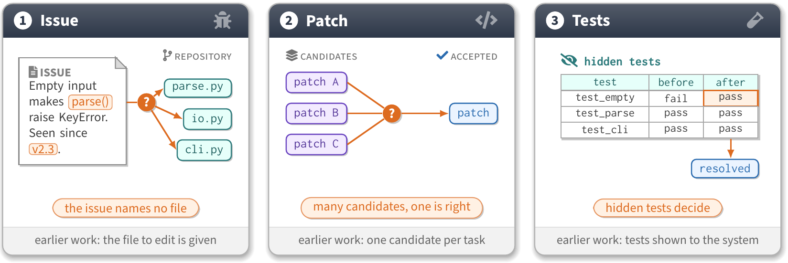
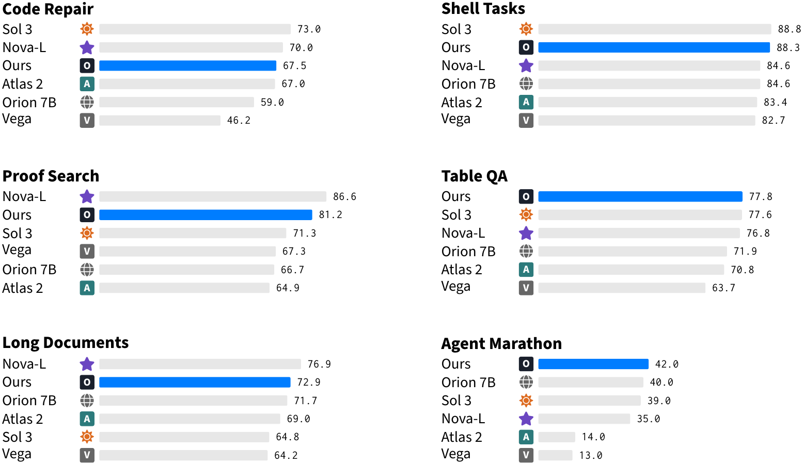

# tikz-paper-figure

用 TikZ 和 pgfplots 画论文配图，全文一套样式：首页的卡片式先导图、结果榜单和中间所有数据图共用同一组字体、配色与尺寸。仓库里有两个样式包、三个模板、36 个已编译的范例、构建与检查脚本，以及一个 Claude Code skill，能从「把表 2 画成图」这样一句要求做到交付渲染图。

[English](README.md)






卡片画示意，面板画榜单，曲线画趋势。36 个范例都在[图库](skills/tikz-paper-figure/references/gallery.md)里，每张写明它回答什么问题、源码在哪。

## 内容

- 样式包。`cardfig.sty` 提供带深色标题栏、标签条、脚注带和阴影的卡片，以及基准条形面板；`plotfig.sty` 给 pgfplots 一个 `paper` 坐标轴样式，同一套字体与配色，系列名直接标在图上，柱从零起，灰色刻度，数字用正文字体。
- 三个模板（`template.tex`、`template-bars.tex`、`template-plot.tex`）和 36 个带渲染图的范例：3 张卡片图、1 张条形面板、28 张数据图、4 张组合图。
- 脚本。`build_figure.py` 编译、清理、对照正文宽度检查尺寸并输出 PNG；`bars_from_csv.py`、`flows_from_csv.py`、`treemap_from_csv.py` 从数据生成图；`palette_check.py` 在模拟色觉缺陷下测量配色距离；`compare_sheet.py` 把两版图叠成一张对照；`check_env.py` 列出本机装了什么。
- 参考文档。Wilke《Fundamentals of Data Visualization》的要点笔记与选图决策表、卡片元素目录、每种图一份配方、常见问题与修法。
- `SKILL.md`：agent 从确定内容到交付渲染图的工作流。

## 安装

**作为 Claude Code skill。** 把 skill 目录复制到个人 skills 目录，或某个论文仓库的 `.claude/skills/`。

```bash
git clone https://github.com/HomuraT/tikz-paper-figure.git
cp -r tikz-paper-figure/skills/tikz-paper-figure ~/.claude/skills/
```

```powershell
git clone https://github.com/HomuraT/tikz-paper-figure.git
Copy-Item -Recurse tikz-paper-figure/skills/tikz-paper-figure "$env:USERPROFILE/.claude/skills/"
```

目录布局也符合 `npx skills add HomuraT/tikz-paper-figure --skill tikz-paper-figure` 的要求，这条路径没有测过。

**只要模板，不用 agent。** 把 `skills/tikz-paper-figure/assets/cardfig.sty` 或 `plotfig.sty` 复制到图源目录，按下面的快速上手走。`.sty` 进了项目，Overleaf 上也能编译。

## 快速上手

先跑一次 `python skills/tikz-paper-figure/scripts/check_env.py`，它会列出缺哪个 TeX 宏包或工具，以及缺了会坏什么。

1. 把 `plotfig.sty`（数据图）或 `cardfig.sty`（卡片、条形面板）复制进论文的 `figures/`。
2. 从 `skills/tikz-paper-figure/assets/examples/` 挑最接近的范例复制为 `figures/name.tex`，换成自己的数据。结果榜单改从 CSV 生成：
   ```bash
   python skills/tikz-paper-figure/scripts/bars_from_csv.py results.csv --ours Ours --cols 2 --out figures/results.tex
   ```
3. 构建，然后看 PNG：
   ```bash
   python skills/tikz-paper-figure/scripts/build_figure.py figures/name.tex --png-dir figures
   ```
   脚本会打印页面尺寸，并按 5.5 英寸正文宽给出是否超宽的判定（别的版式用 `--max-width`）。
4. 论文里写 `\graphicspath{{figures/}}` 和不带宽度的 `\includegraphics{name.pdf}`。图按最终尺寸设计，缩放会改变字号。

## 配合 agent 使用

装好 skill 后，这类要求会触发它：

- 「给这篇论文画 Figure 1：三张卡片，例子用 Listing 1。」
- 「把表 2 画成结果图，我们的系统用蓝色。」
- 「5.2 节的消融用什么图？画出来。」
- 「把 `figures/curves.tex` 的图例挪到图上方，别的都不动。」

skill 按段落要回答的问题选图，复制最近的范例，编译，读渲染图，汇报跑了哪些检查。修改已有图时，要求被拆成「改什么」和「保持什么」两张清单（数据、颜色、尺寸、没点名的元素位置），回复里给出 diff 和前后对照图。机器上没有 TeX 时，skill 会说明图没有编译，不会描述一张谁也没见过的渲染图。

## 环境要求

| | |
|---|---|
| TeX | TeX Live 2023 或更新（或 MiKTeX），含 `standalone`、`pgfplots` 1.18+、`tikzmark`、`fontawesome5`、`sourcesanspro`、`inconsolata`；`lualatex` 只有等高线图用到 |
| PDF 工具 | poppler 的 `pdfinfo` 与 `pdftoppm`（Windows 版 TeX Live 自带） |
| Python | 3.9 或更新；Pillow 只有 `gallery_sheet.py` 用到 |

在 Windows 11、TeX Live 2025、Python 3.13 和 Claude Code 上测过。`SKILL.md` 遵循 [Agent Skills](https://agentskills.io/specification) 格式，读这种格式的其他 agent 应该也能加载，只试过 Claude Code。

## 范例与测试

- [`examples/results-from-csv`](examples/results-from-csv)：从 CSV 生成四个基准的结果榜单，其中一项因为越低越好而反向排序，附命令与构建输出。
- [`examples/constrained-revision`](examples/constrained-revision)：给一张已有图加一条参考线，附改动清单、保持清单、diff 和前后对照图。
- [`tests/`](tests)：三条带验收标准的任务（从 CSV 生成结果图、三张风格各异的图统一而不改数据、只挪图例），用于对比有无 skill 的运行结果。目前还没跑过。

## 规则出处

样式、配色和选图背后的道理写在博客文章里：[用 TikZ 统一论文配图：样式规范、模板与构建流程](https://blog.homura.work/posts/tech/latex/tikz-paper-figure/)。数据图的默认值来自 Claus O. Wilke 的《Fundamentals of Data Visualization》，[`references/principles.md`](skills/tikz-paper-figure/references/principles.md) 是转述的要点笔记，每条规则链接到原书章节，并写明本样式有意偏离原书的地方。卡片版式参考了 SWE-bench、Spider 2.0 和 BIRD 的 Figure 1。

## 相关项目

- [OpenTikZ](https://github.com/opentikz/opentikz)：概念示意图的图标库与可编辑模板，带 Claude Code skill。本仓库每个模板里的修订约定来自它的 `edit_contract` 思路。
- [tikz-academic](https://github.com/Noi1r/tikz-academic)：面向学术 TikZ 图的 skill，每种图型一份参考文件。
- [tikz-constraint-harness](https://github.com/zane-gao/tikz-constraint-harness)：面向 Codex 的约束优先 TikZ 生成与修复。本仓库修订流程里的「改什么、保持什么」两张清单沿用了同一思路。
- [tikz-diagrams-skill](https://github.com/Patrick-Healy/tikz-diagrams-skill)：从文字、截图和手绘到 TikZ，带编译、渲染、检查脚本。
- [scientific-plotting-skill](https://github.com/dazhiyang/scientific-plotting-skill)：ggplot2 与 plotnine 的出版规范，只有一个 `SKILL.md`。

## 许可证

脚本、`SKILL.md` 和参考文档采用 [MIT 许可证](LICENSE)。`skills/tikz-paper-figure/assets/` 下的全部内容（两个样式包、模板、范例源码及其渲染图）以 [CC0 1.0](LICENSE-ASSETS) 放入公有领域，论文仓库复制它们不必附带任何声明。

未打包进仓库的部分：字体（Source Sans Pro、Inconsolata）和 Font Awesome 图标来自 TeX Live 宏包，各有自己的许可证。Wilke 的书是 CC BY-NC-ND 4.0，本仓库只转述其规则并链接到章节，不复制其文字或图片。
