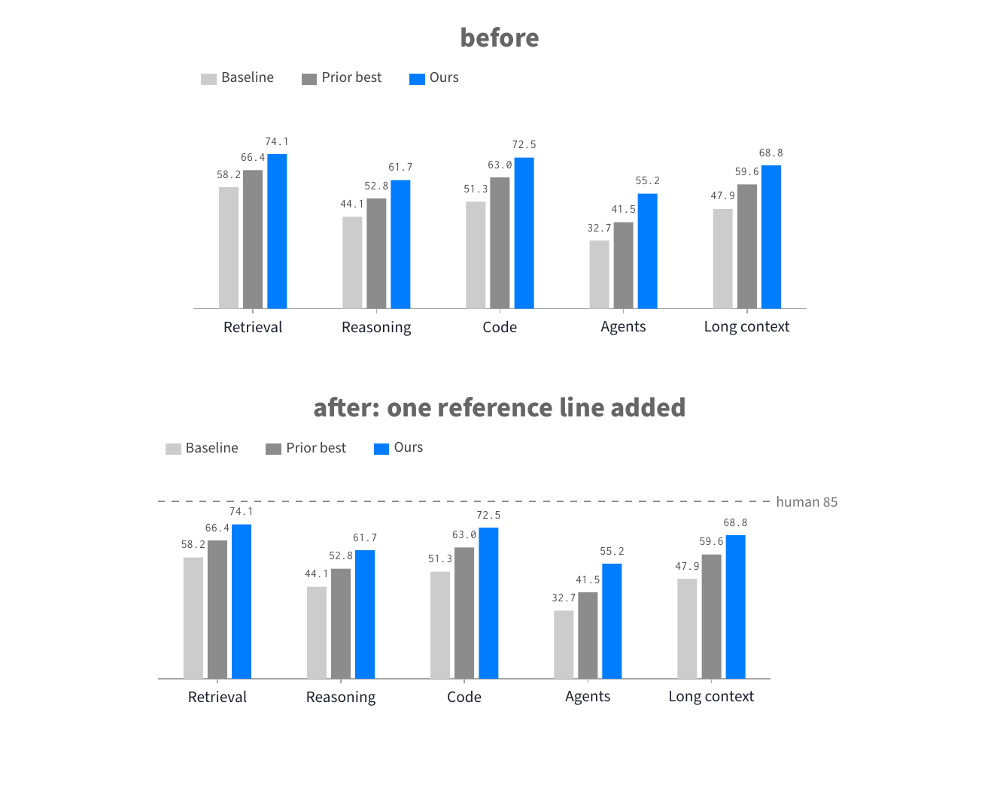

# One change, everything else kept

**Request.** "Add a dashed reference line for human performance (85) to the grouped bar chart and label it. Change nothing else."

**Change list.** One reference line at y = 85 across the plot in the dashed grey `ref` style, labelled "human 85" at its right end, drawn before the bars so that it stays behind them.

**Keep list.** The data of all three series, the colours (two greys, ours in blue), the legend row and its order, width and height, bar width, tick labels, and the `bars labelled` style that prints the values. Every line of `before.tex` other than the header comment appears unchanged in `after.tex`.

`before.tex` is the skill's example `assets/examples/plots/grouped-bars.tex`, copied as is.

**Diff.**

```diff
-% Candidate 2: grouped bars with the value printed on every bar, so the y axis and the grid are dropped.
-% Ours in bright blue, the two comparison systems in two greys; legend as a row of squares above the plot.
+% After: the grouped bars of before.tex with one reference line added at the human score (85), labelled at
+% its right end. Everything else is before.tex verbatim: data, colours, size, legend, tick labels. The line is
+% drawn before the bars so it stays behind them; `ref` is the only dashed style in the house (plotfig.sty).
   enlarge x limits=0.12]
+\draw[ref] ({rel axis cs:0,0}|-{axis cs:Retrieval,85}) -- ({rel axis cs:1,0}|-{axis cs:Retrieval,85}) node[dl, text=black!55] {human 85};
 \addplot[fill=black!20, draw=none] coordinates {(Retrieval,58.2) (Reasoning,44.1) (Code,51.3) (Agents,32.7) (Long context,47.9)};
```

**Commands** (repository root).

```bash
python skills/tikz-paper-figure/scripts/build_figure.py examples/constrained-revision/before.tex examples/constrained-revision/after.tex --png-dir examples/constrained-revision
python skills/tikz-paper-figure/scripts/compare_sheet.py --out examples/constrained-revision/before-after.png "before=examples/constrained-revision/before.pdf" "after: one reference line added=examples/constrained-revision/after.pdf"
```

```text
[build] before.pdf: 270.9 x 126.1 pt  (9.52 x 4.43 cm)  width ok
[build] after.pdf: 302.0 x 126.1 pt  (10.61 x 4.43 cm)  width ok
```

The page grew by 1.1 cm on the right: the label hangs outside the axis, where the `paper` style puts direct labels (`clip=false`). Bars, legend and tick labels did not move.

**Result.**



**Checks.** Both compile. Both width verdicts `ok`. The diff above shows that the keep list held. `after.png` was read to confirm that the line sits behind the bars and that the label clears the last bar.
