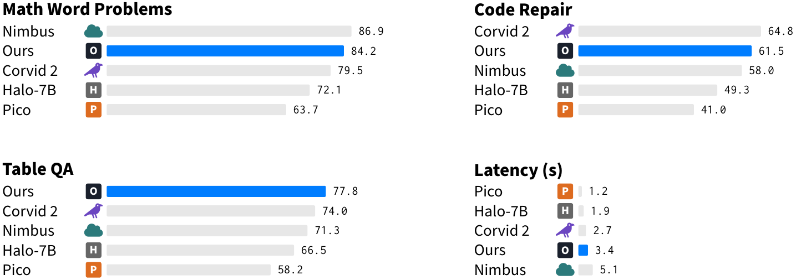

# A results grid from a CSV

**Request.** "Table 3 compares five systems on three accuracy benchmarks and on latency. Make the results figure; ours is called Ours."

**Input.** `results.csv`: one row per system, one column per benchmark, an `icon` column for the small logos (a letter with an optional colour, or a Font Awesome icon name).

```csv
system,icon,Math Word Problems,Code Repair,Table QA,Latency (s)
Ours,letter:O,84.2,61.5,77.8,3.4
Nimbus,fa:cloud:dbA,86.9,58.0,71.3,5.1
Corvid 2,fa:crow:dbB,79.5,64.8,74.0,2.7
Halo-7B,letter:H:black!60,72.1,49.3,66.5,1.9
Pico,letter:P:addc,63.7,41.0,58.2,1.2
```

**Commands** (repository root). Latency is the one metric where less is better, so that column is sorted the other way round.

```bash
python skills/tikz-paper-figure/scripts/bars_from_csv.py examples/results-from-csv/results.csv --ours Ours --cols 2 --lower-better "Latency (s)" --out examples/results-from-csv/results-bars.tex
python skills/tikz-paper-figure/scripts/build_figure.py examples/results-from-csv/results-bars.tex --png-dir examples/results-from-csv
```

```text
[bars] wrote examples\results-from-csv\results-bars.tex (4 panels, 5 rows max, track max 100)
[build] results-bars.pdf: 344.3 x 121.4 pt  (12.10 x 4.27 cm)  width ok
[build] render: ...\examples\results-from-csv\results-bars.png
```

**Result.**



**Checks.** Compile clean. Width verdict `ok` against a 5.5 in text width. Render read: no name touches its icon, every value sits inside its panel, the latency panel runs from the fastest system down. The numbers were compared against the CSV row by row.

The generated `results-bars.tex` loads `cardfig.sty`, which `build_figure.py` finds in the skill's `assets/` through `TEXINPUTS`. In a paper repository, copy `cardfig.sty` next to the figure so that Overleaf and co-authors compile it too.
