# Gallery: every example in this skill

All thirty-six renders on one page, with the question each answers and where its source and recipe live.
Paths are relative to the skill root. Open the render closest to the figure at hand before drawing; it is the
target. `assets/examples/gallery.png` tiles the same renders into one image; regenerate it with
`python scripts/gallery_sheet.py` after adding or re-rendering an example.

Contents: [Card figures](#card-figures-cardfigsty) (3) · [Bar panels](#benchmark-bar-panels-cardfigsty) (1) ·
[Data plots](#data-plots-plotfigsty) (28): amounts, gains and paired data, trends, classifier quality,
distributions, composition, matrices · [Composite figures](#composite-figures) (4).

## Card figures (cardfig.sty)

Schematics: cards with dark title bars, blurred shadows, one running example, orange for the one hard thing.
Building blocks and sizes in `references/elements.md`; workflow in `SKILL.md`, sections 1 to 6.

### teaser-points: three parallel points


Figure 1 of a paper whose text enumerates two to four difficulties or contributions. One card per point,
numbered badges matching the enumeration, a document page with highlighted phrases, chips, a table with one
highlighted cell, an orange pill stating the open decision, a footer band with the baseline assumption.
Source `assets/examples/teaser-points.tex`; skeleton `assets/template.tex`.

### pipeline-stages: stages of a procedure

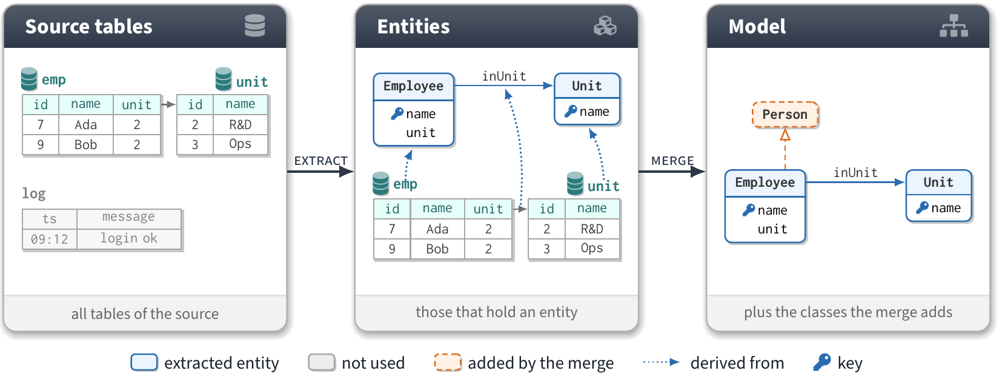

A method or construction overview read left to right through labelled stage arrows. Source tables with a
foreign key and one greyed table, extracted class boxes with key icons and dotted derivation arrows, an added
element in orange and dashed, a legend under the row. Source `assets/examples/pipeline-stages.tex`.

### io-two-cards: input and output of one step

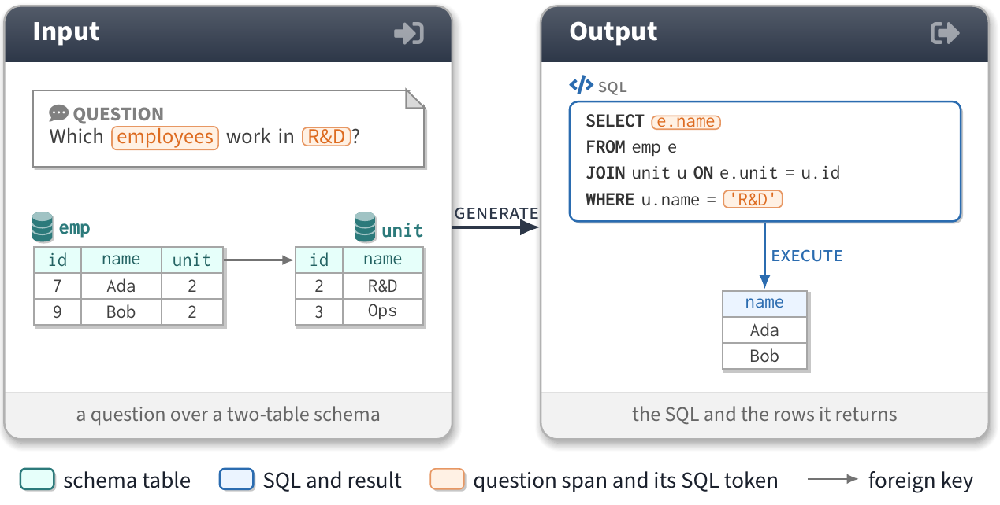

Two cards for one transformation. Left: the question as a document page and the schema as teal tables. Right:
a code block with the grounded tokens highlighted and a blue result table. A legend spans both cards. Two cards
need not fill the text width. Source `assets/examples/io-two-cards.tex`.

## Benchmark bar panels (cardfig.sty)

### bench-bars: our rank on many benchmarks


A 2 x 3 grid, one benchmark per panel, rows sorted best first, our system in bright `barblue`, the rest in
`bargrey`, the score in monospace at the bar end, optional logos. All bars share one scale. Generated:
`python scripts/bars_from_csv.py bench-bars.csv --ours "Ours" --cols 3 --out bench-bars.tex` from
`assets/examples/bench-bars.csv`; `--keep-order` for ordered rows. Hand-written skeleton `assets/template-bars.tex`.

## Data plots (plotfig.sty)

Ordered by the question the paragraph asks; the decision tables in `references/principles.md` say why, and the
recipes in `references/plots.md` give the code. Ours is blue in every plot; series are named on the plot; digits
are in the text font. Sources are `assets/examples/plots/<name>.tex`.

### Amounts and comparisons

#### grouped-bars: a few systems on a few benchmarks

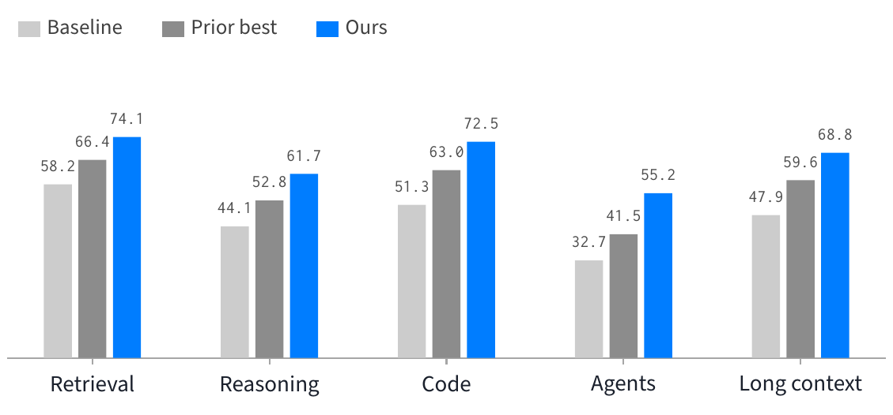

Two categorical variables, three series at most. Values printed on every bar, so the y axis and grid are
dropped; ours in blue, the others in two greys; legend as squares above (`legend top`). Bars start at zero
(`bars labelled` pins it).

#### dots: values that all lie close together

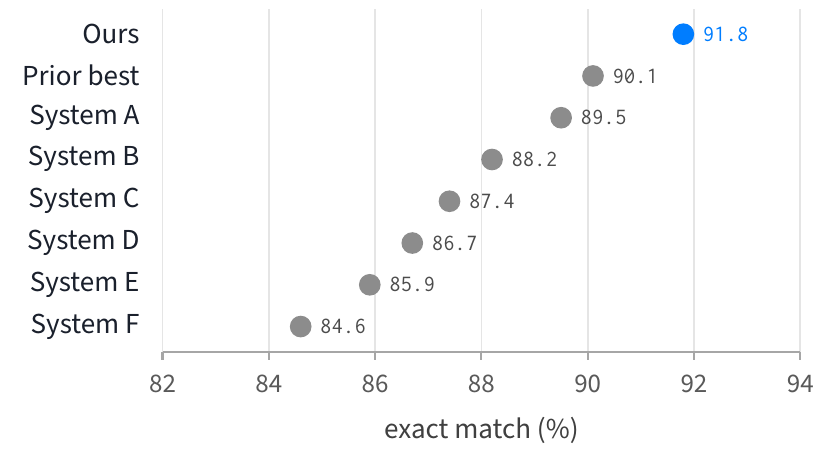

The alternative to bars when every value sits in a narrow band (here 84 to 92): dots on an axis cut to the data
range, rows sorted by value, ours in blue, every value printed so the truncated axis cannot mislead.

#### ablation: what each component contributes

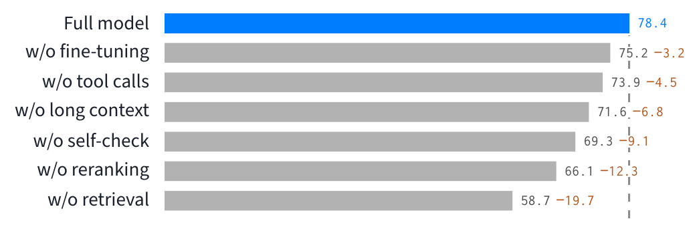

The full model on top in blue, one grey bar per removed component, sorted by the score that remains. The score
is printed at every bar end and the drop against the full model after it in orange; a dashed reference line at
the full score makes the drops readable as gaps. Rows are the components, so the labels stay horizontal.

#### waterfall: how the components add up

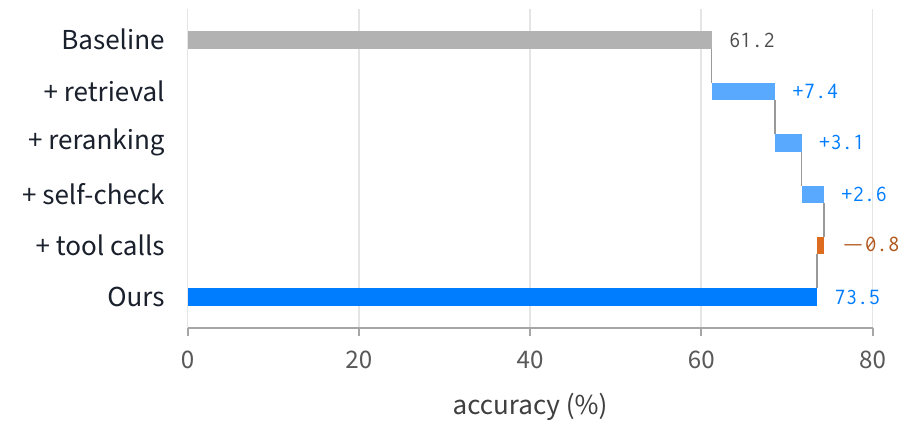

The same question as the ablation, asked forwards: the baseline and our final score are full bars from zero,
each added component a floating bar equal to its delta (blue when positive, orange when negative) in the order
the components were added, with thin connectors carrying the running total. Catalogues call it a bridge chart.

#### funnel: yield of a construction pipeline

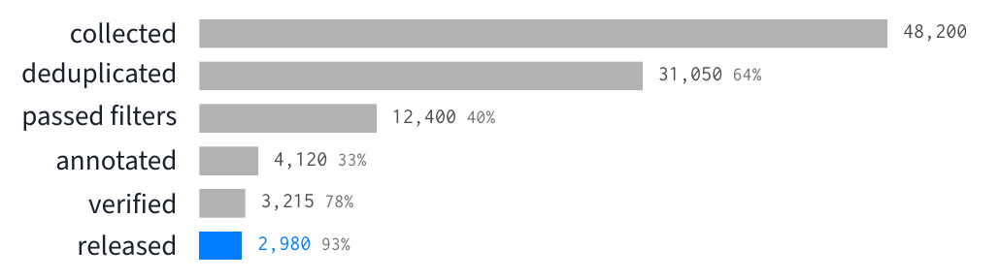

One bar per stage in process order, never sorted by value; the count printed at the bar end and the share
retained from the previous stage after it in small grey. Only the released set is blue. When items branch
rather than drop out, the parallel sets (`flows`) take over.

#### stacked-counts: how many errors, of what kind

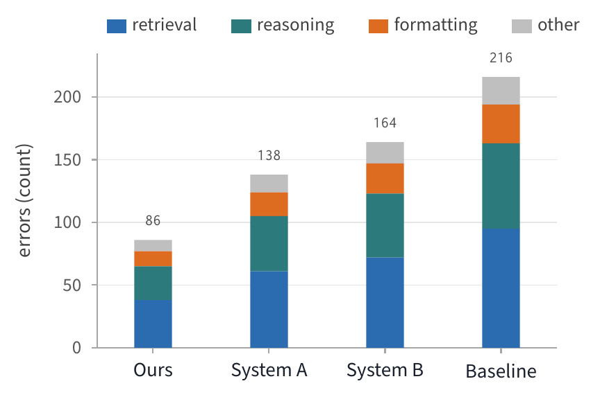

Stacked bars whose heights are counts, so the total is meaningful and printed above every stack, and the count
axis stays (unlike `stacked-100`, whose bars all reach 100). One colour per error category in the palette
order, legend as squares above.

### Gains and paired data

#### dumbbell: gains over a baseline, up to about ten rows

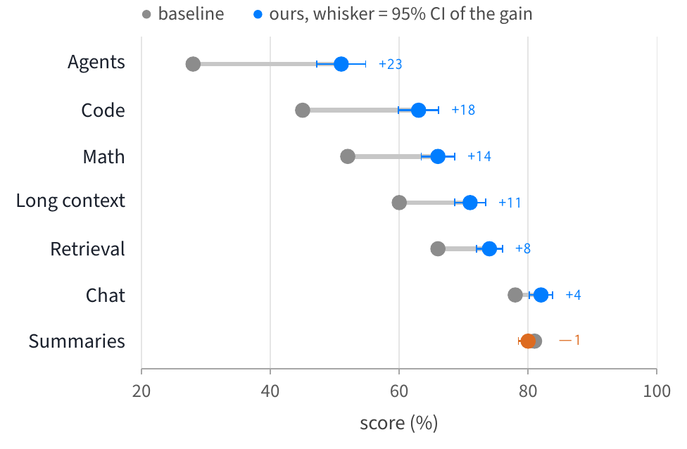

Grey dot = baseline, blue dot = ours, the gain printed after the pair, rows sorted by gain. The whisker at the
blue dot is the 95% CI of the gain; if it reaches back to the grey dot, the gain does not exclude zero.

#### parity: gains over many items

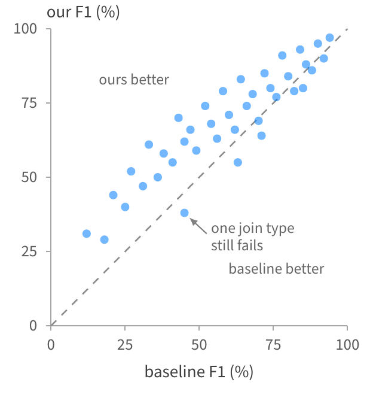

One dot per task, baseline score on x, ours on y, the x = y line as the only reference (no grid), translucent
dots because rounded scores tie, square axes with equal ranges. Replaces the dumbbell beyond about ten items or
when the message is a systematic shift.

#### slope: who gained and who lost between two conditions

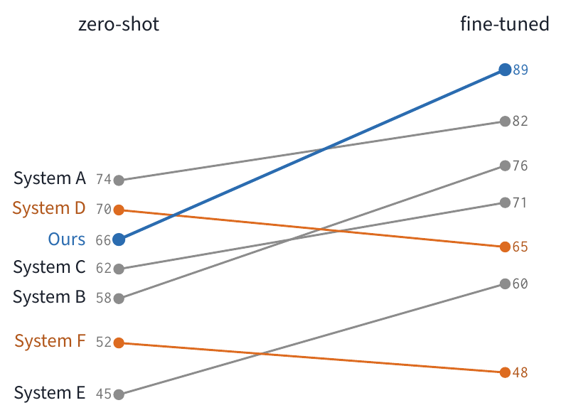

A slopegraph: one line per system from its value under the first condition to its value under the second,
names and values at the ends, no y axis. Ours in blue and thicker, the systems that got worse in orange, the
rest grey. Direction and steepness are the message; the dumbbell shows the size of a gap instead.

#### win-tie-loss: pairwise preference against each opponent

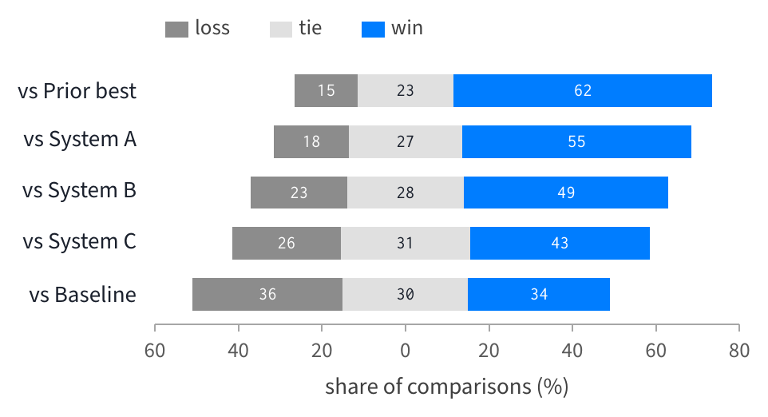

The human-evaluation figure of LLaMA-2 and MT-Bench, centred: the tie share sits on zero, wins extend to the
right in blue, losses to the left in dark grey, so the right ends compare win rates and the left ends loss rates
across rows. Percentages inside the segments, unsigned tick labels, headers as a legend row.

### Trends over an ordered x

#### curves-bands: growth over data, time or compute


Learning curves in two panels (groupplots), translucent confidence bands (`band`), series named at their line
ends, one dashed reference line, one annotation. Marks stay because the x grid is sparse. The caption states
what the band is (here 95% CI over 5 seeds). Plain skeleton `assets/template-plot.tex`.

#### training-curves: seeds behind the mean

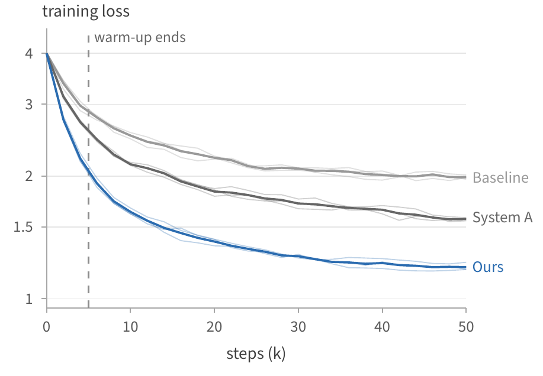

Loss against steps on a log y axis for three configurations; every seed as a faint thin line (`runs`) behind
the bold mean, labels at the line ends, one dashed reference at the end of warm-up. The spread is visible
without a band; beyond about a dozen runs use bands.

#### scaling-law: a power law and its held-out check

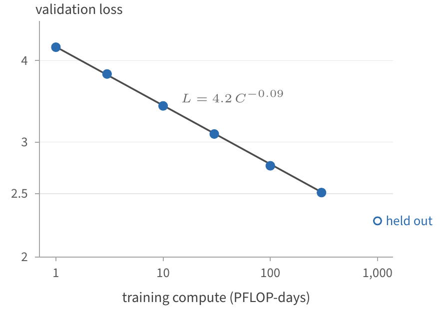

Log-log axes whose ticks read as values, measured models as dots, the fit as a straight `trend` over the fitted
range and no further, its form printed once beside the line, the largest model as a hollow mark labelled "held
out". The fit is never extended past the data; the held-out point shows whether it would have predicted.

#### pareto: cost against quality

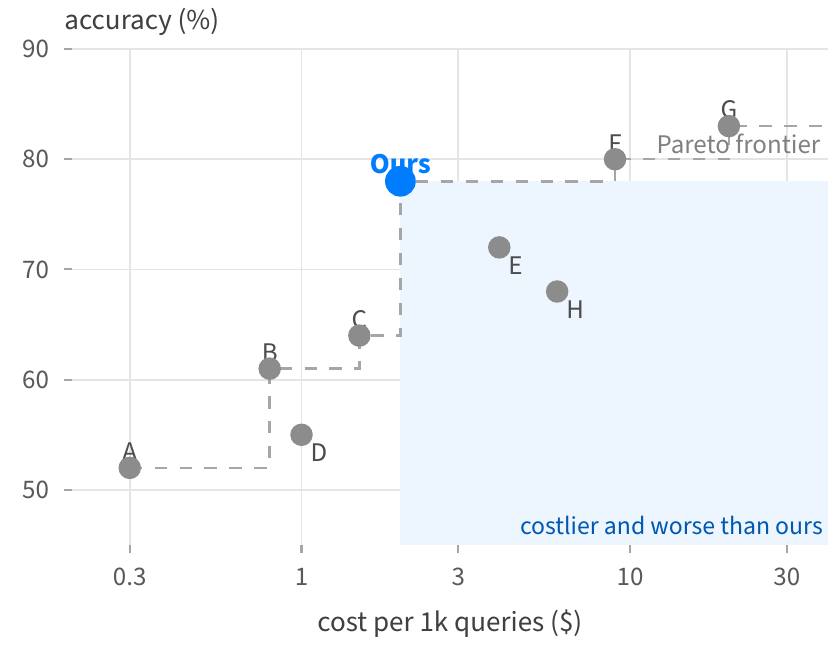

Scatter with a log x axis whose ticks read as values (`xmode=log, log ticks x`), every point named, ours as the
large blue dot, the region it dominates tinted, the frontier as a grey staircase, grid in both directions and no
axis lines (`both grids`). A zero cost cannot sit on the log axis.

### Classifier quality

#### roc-pr: ROC beside precision-recall

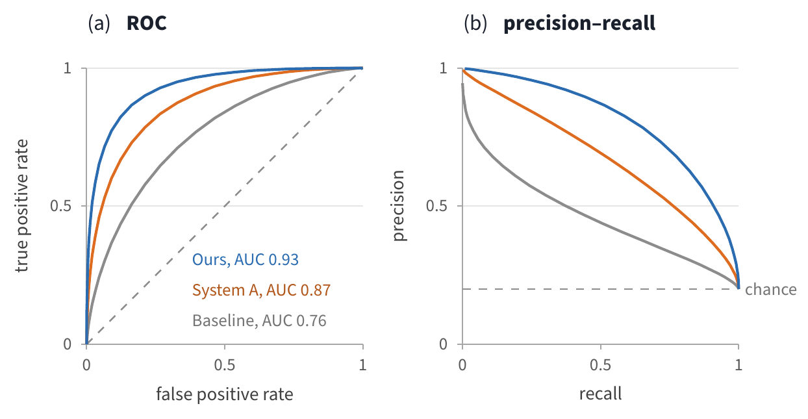

Two square panels with (a)/(b) letters: ROC curves against the chance diagonal, and precision-recall curves
against the positive rate, three classifiers in one colour each, the AUC carried in the labels. The PR panel is
the one to read when positives are rare. Labels stand stacked in the empty corner because the panels are too
narrow to set them along the curves.

#### calibration: is the confidence honest

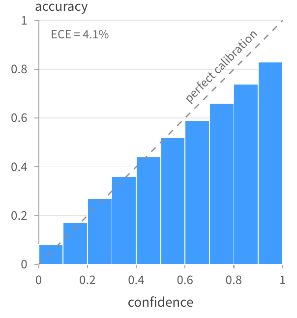

A reliability diagram: mean accuracy per confidence bin as touching bars against the x = y line, square axes
from 0 to 1, the ECE printed once, the diagonal labelled. Bars below the line mean overconfidence. The caption
states the number of bins and n.

### Distributions

#### histogram-ecdf: how a statistic is distributed

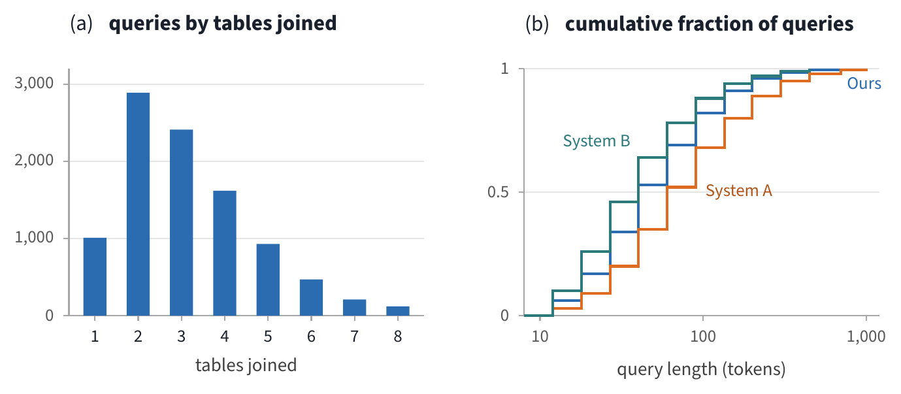

A compound figure with (a)/(b) letters set by `\plab`. (a) One bar per integer, bars touching, one fill, y from
zero. (b) Empirical cumulative distribution of a heavy-tailed statistic per system on a log x axis, labels placed
where the curves separate. Two `axis` environments placed with `name=` and `at=`, because a groupplot cannot
switch one panel to log.

#### densities: one statistic in two or three groups

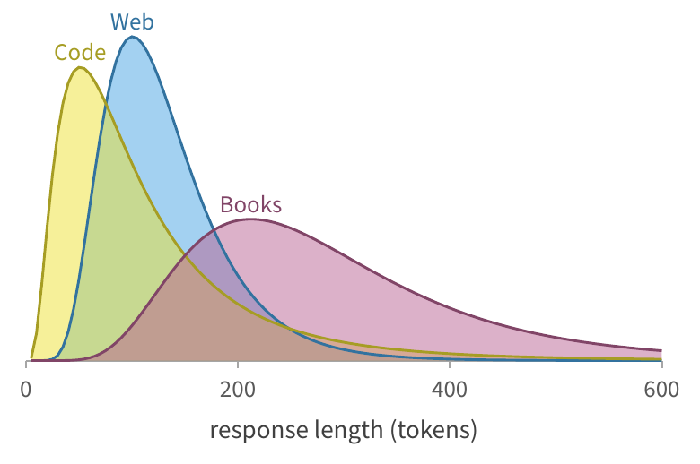

Overlaid density curves filled in the light `set*` colours at half opacity so the overlaps blend, outlines and
labels in the darker shade at each peak, no y axis because density values carry no meaning for the reader.
For more than three groups, the ridgeline.

#### ridgeline: a distribution shifting along an ordered variable

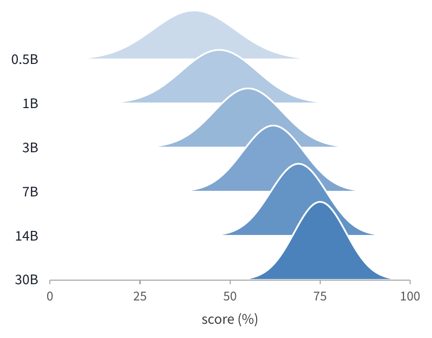

Six densities, one per model size, each on its own baseline, the front ridges covering the back ones with a
white edge between them, fills as a lightness ladder of the house blue because the sizes are ordered. The y
axis carries the group names, not densities.

#### boxplots: per-item spread for several systems

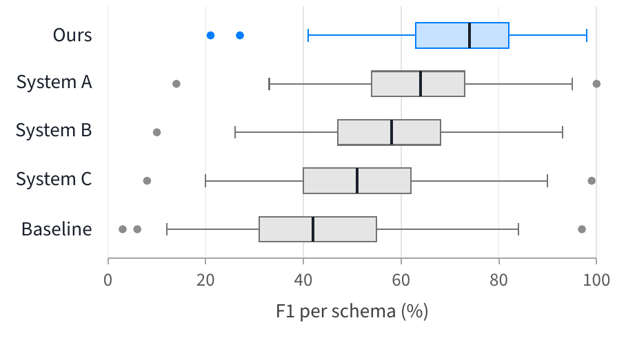

Horizontal boxes (`boxes`), rows sorted by median, ours on top in blue (`box ours`), the rest grey, outliers as
a separate marks-only plot. Replaces mean with error bar, which hides spread and skew. Needs dozens of items per
box; fewer than about ten: strips.

#### strips: a handful of seeds per system

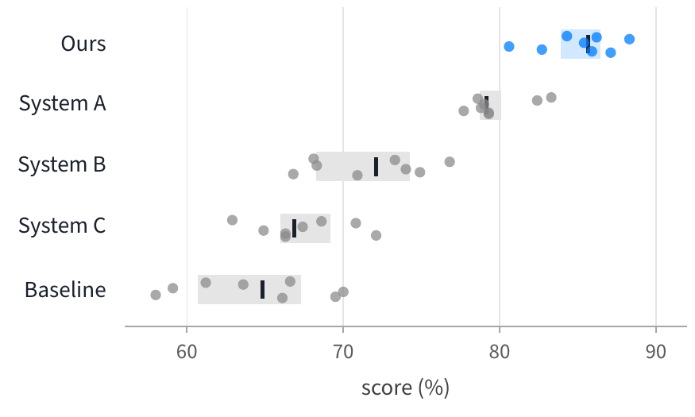

Eight seeds per row as jittered dots (jitter along the row only, precomputed), a light quartile box behind them
and a dark median tick, ours in blue. With so few values the reader should see every one of them; the caption
states n.

#### scatter-margins: a relation and both distributions

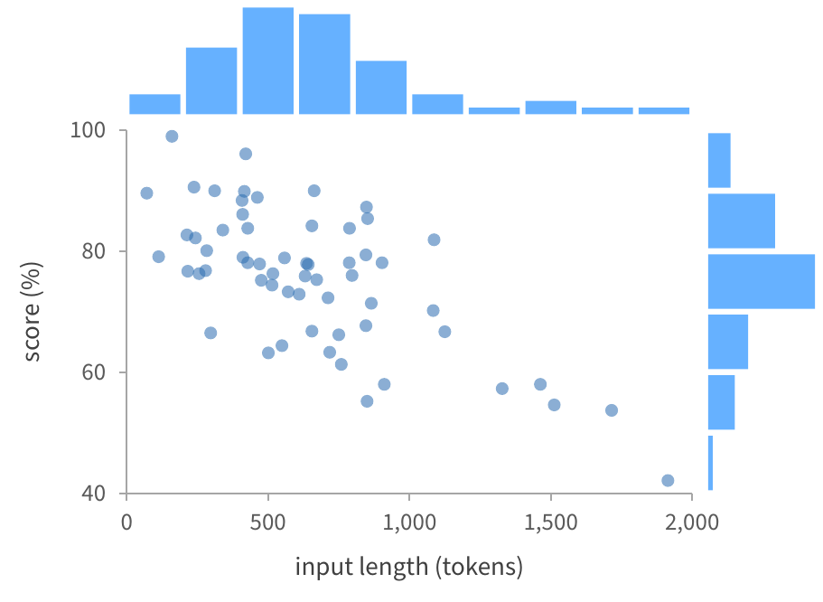

A scatter with the histogram of x above it and the histogram of y beside it, three axes aligned through their
shared sizes and ranges, the y range cut to the data because dots need no zero. One panel instead of three
figures.

### Composition and shares

#### stacked-100: shares across groups

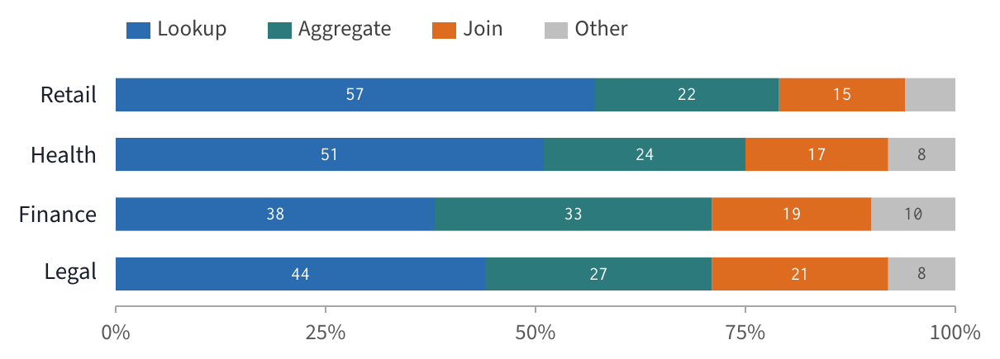

Composition per group as 100% stacked horizontal bars, every percentage printed inside its segment, legend as
squares above. Accepted with four segments only because the numbers are printed; two segments (the category of
interest against a grey remainder) when one category is the message.

#### donuts: composition of one whole

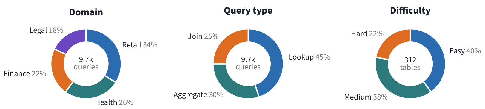

Three donuts, one per dimension of a dataset, the total in the hole, labels with percentages outside, at most four
slices each, white gaps between slices. Pure TikZ. Five or more parts, or parts to be compared precisely, go into
sorted bars.

#### treemap: two nested categorical variables

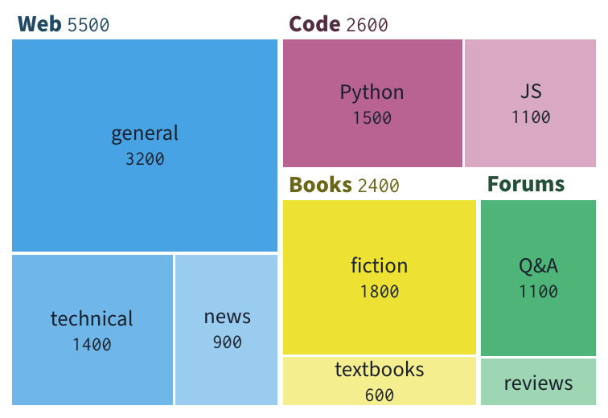

A squarified treemap generated from a CSV of `group,item,value`: one light hue per group, a lightness ladder for
the items inside it, white separators, every cell printing its name and number when they fit, the group's name
and total in a white strip above its cells. Generated:
`python scripts/treemap_from_csv.py treemap.csv --out treemap.tex --width 6.2 --height 4.2` from
`assets/examples/plots/treemap.csv`.

#### flows: three or more categorical variables

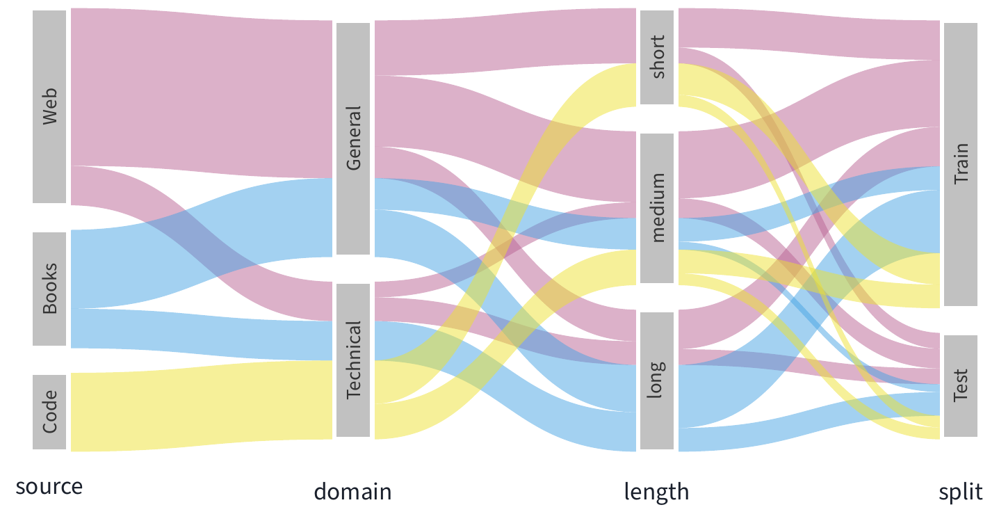

Parallel sets after Wilke: grey node bars (`setgrey`) with a thin white outline and the category name set
vertically inside, variable names beneath the columns, bands in the light `set*` colours at opacity 0.5, coloured
by the leftmost variable and grouped by colour in every node, no numbers unless `--label-min`. Generated:
`python scripts/flows_from_csv.py flows.csv --col-gap 3.7 --height 5.4 --out flows.tex` from
`assets/examples/plots/flows.csv` (one row per record group, header = variable names, `count` column).

### Matrices and many dimensions

#### heatmap: a matrix or a large table

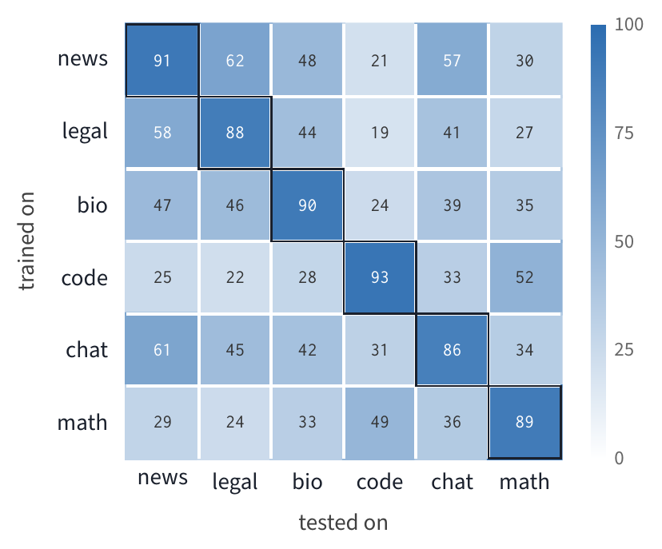

A transfer matrix with the value printed in every cell, single-hue map from white to blue (`paperblues`), white
text on dark cells, the diagonal outlined, a slim colour bar. `paperdiv` for values around a meaningful
midpoint.

#### radar: several systems over several capabilities

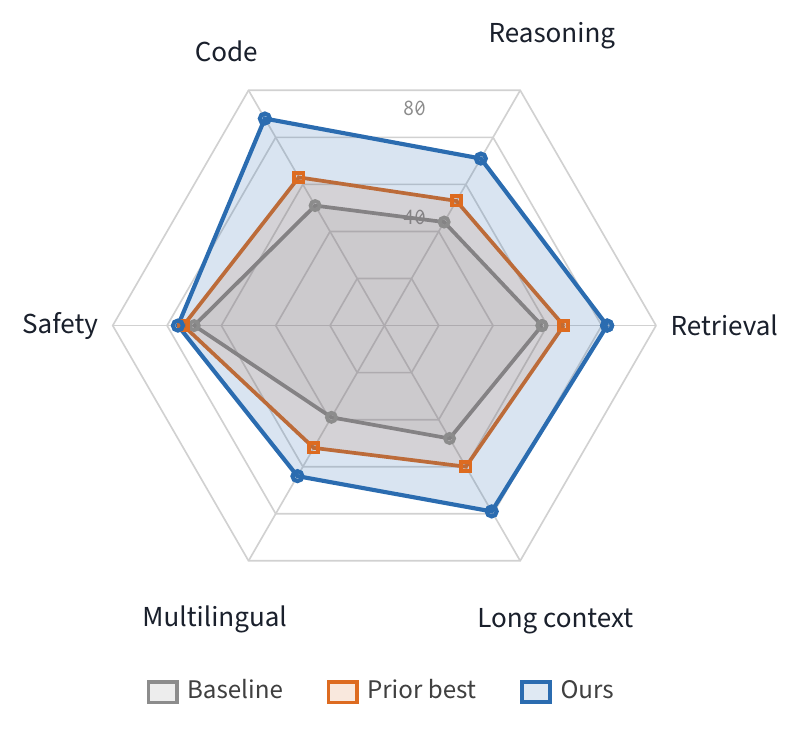

Three systems over six capabilities, polygon grid, filled polygons at low opacity, the radial scale printed once,
compact legend below. The book has no chapter on radar charts; six axes and three systems is the upper bound,
and grouped bars or bar panels say the same more precisely.

## Composite figures

Several panels built in one standalone, so their axes and baselines align and one legend serves all of them.

#### small-multiples: one relation across many benchmarks

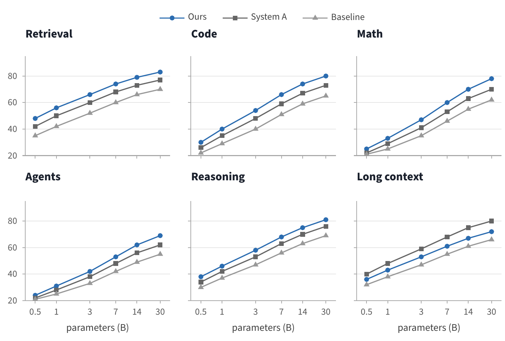

A 3 x 2 grid of line charts, one benchmark each, every panel with the same x and y ranges, tick labels only on
the left column and the bottom row, one legend above the grid. Titles identify the panels, so no letters. The
figure has a point: ours leads on five and trails on one.

#### stacked-panels: two quantities on one shared x

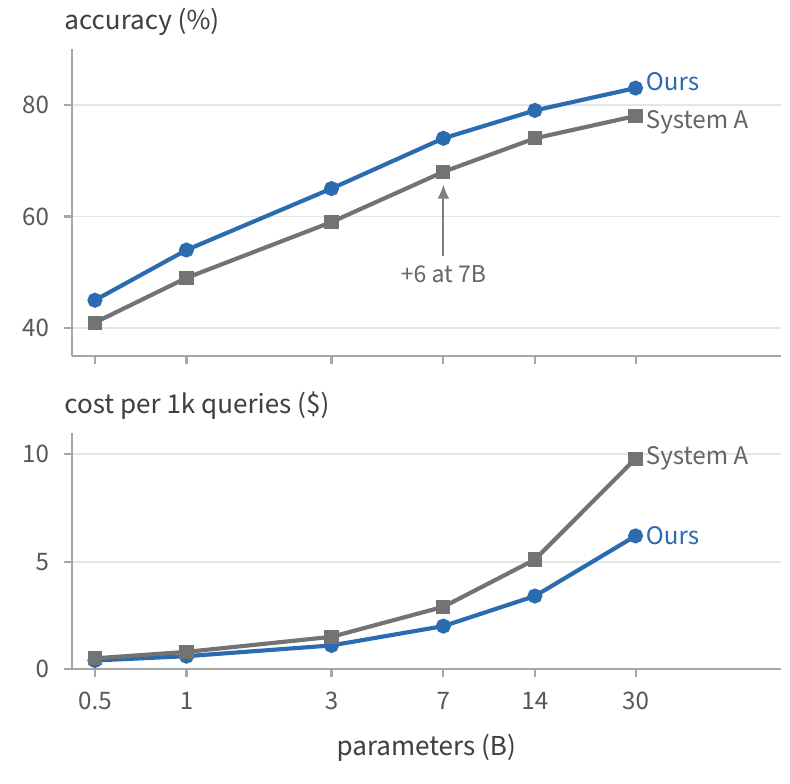

Accuracy above, cost below, the x axis set once at the bottom, the same two systems in the same colours with
labels at the line ends, one annotation. This is the replacement for a chart with two y axes, which the book
does not use.

#### inset-zoom: the whole run and its end

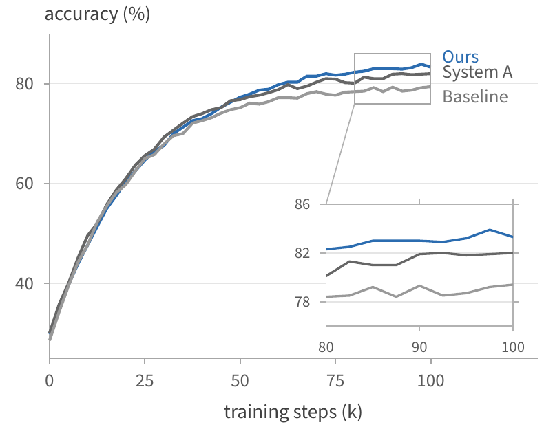

A line chart with a small second axis inside it magnifying the region where the curves converge, the region
marked by a thin rectangle on the main axis and joined to the inset by one connector. The inset keeps the
colours and shows its own ticks; the caption says what it magnifies.

#### mixed-panels: three chart types in one figure

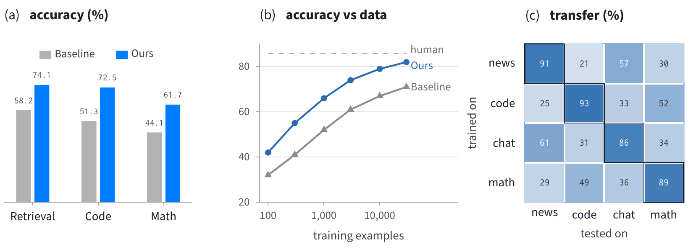

Grouped bars, a learning curve and a transfer matrix side by side, all 3.2cm high with their baselines on one
line, (a)/(b)/(c) letters in the titles, ours in blue in every panel. Three separate `axis` environments placed
by anchor; the width is the text-width maximum, so a fourth panel means a second row.

## Regenerating a render

```
python scripts/build_figure.py assets/examples/plots/<name>.tex --png-dir assets/examples/plots
python scripts/gallery_sheet.py
```

The first command rebuilds one example and writes its PNG next to the source; the second retiles the contact sheet.
Generated examples are rebuilt from their CSV first (`flows_from_csv.py`, `treemap_from_csv.py`, `bars_from_csv.py`).
